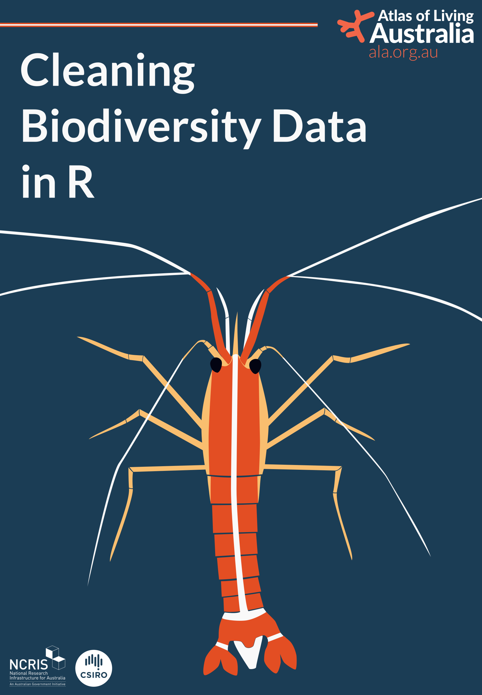

# Cleaning Biodiversity Data in R 

<https://cleaning-data-r.ala.org.au/>

This is the repository for the book *Cleaning Biodiversity Data in R*. This book is a practical guide for cleaning geo-referenced biodiversity data
using R. It focuses specifically on the processes and challenges you'll face with biodiversity data.

### License

This book is available free to read, and is licenced under a [CC BY-NC-ND 4.0 International License](https://creativecommons.org/licenses/by-nc-sa/4.0/). This means that the book can be shared and redistributed as long as appropriate credit is given to the authors, and any minor changes are indicated appropriately. Modified versions that remix or modify the content may not be distributed. See our [licensing and contributing guidelines](https://github.com/AtlasOfLivingAustralia/cleaning_data/blob/main/licensing.md) for more information.

### Contributing

This is a living document and we welcome suggestions and contributions. Please submit a [GitHub issue](https://github.com/AtlasOfLivingAustralia/cleaning_data/issues) detailing any feedback or content requests. See our [licensing and contributing guidelines](https://github.com/AtlasOfLivingAustralia/cleaning_data/blob/main/licensing.qmd) for more information.

### Acknowledgements

This book was inspired by an [Australian Research Data Commons](https://ardc.edu.au/) project where our team worked closely with research partners to streamline their data cleaning workflows. This book is a collaborative effort from the [Science and Decision Support team](https://labs.ala.org.au/about/) at the [Atlas of Living Australia (ALA)](https://www.ala.org.au/).
